# Quantum Tunneling in Spacetime — Interactive Simulation & Research Repository

<p align="center">
  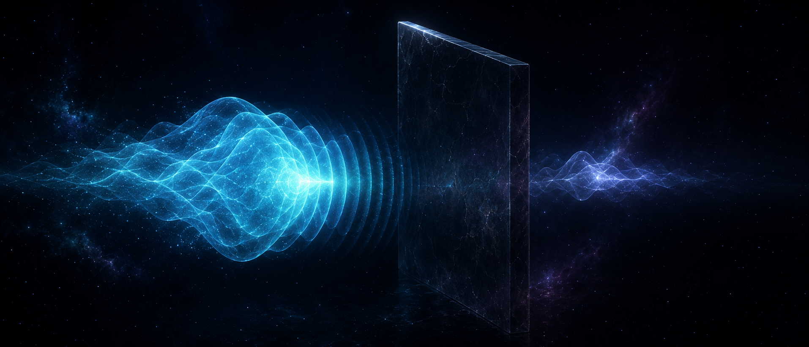
</p>

<p align="center">
  <em>From textbook 1D barrier penetration to tunneling time, Klein tunneling, false-vacuum decay, and Hawking radiation as a tunneling process.</em>
</p>

A research-grade, fully self-contained repository on quantum tunneling: from textbook
1D barrier penetration to the tunneling-time controversy, relativistic Klein tunneling,
and tunneling of spacetime itself: false vacuum decay and Hawking radiation as tunneling.

The centerpiece is an **interactive webpage** (`index.html`) that runs a real
split-operator Schrödinger solver live in the browser — no build step, no server.
A companion **Python suite** reproduces and validates the numerics at research quality.

> **Timely context:** the **2025 Nobel Prize in Physics** was awarded to John Clarke,
> Michel H. Devoret and John M. Martinis for the discovery of *macroscopic quantum
> mechanical tunnelling and energy quantisation in an electric circuit* — a reminder
> that tunneling is no longer only a microscopic curiosity.

---

## Live demo

After enabling GitHub Pages, the project will be available at:

```text
https://biswajit1999.github.io/Quantum-tunneling-spacetime/
```

---

## Visual preview

| Concept                                                | Preview                                                                                                                                          |
| ------------------------------------------------------ | ------------------------------------------------------------------------------------------------------------------------------------------------ |
| Quantum wave packet tunneling through a finite barrier |                  |
| Spacetime mesh tunneling                               | 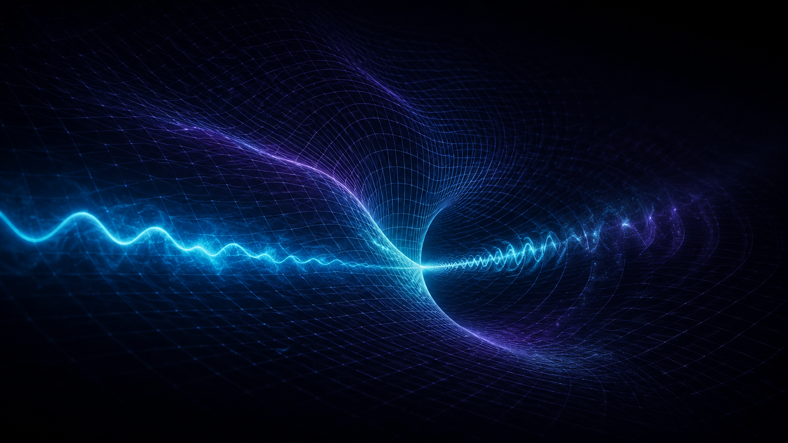             |
| False vacuum dawn                                      | 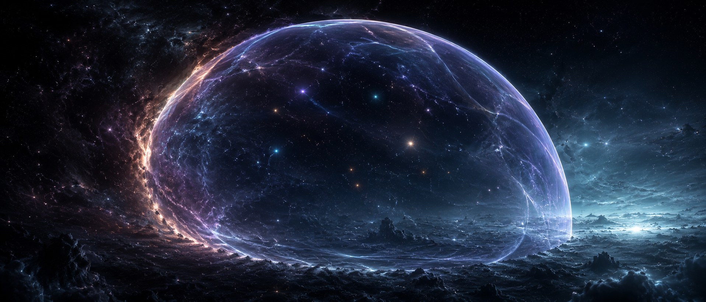                                 |
| Transmission intuition diagram                         | 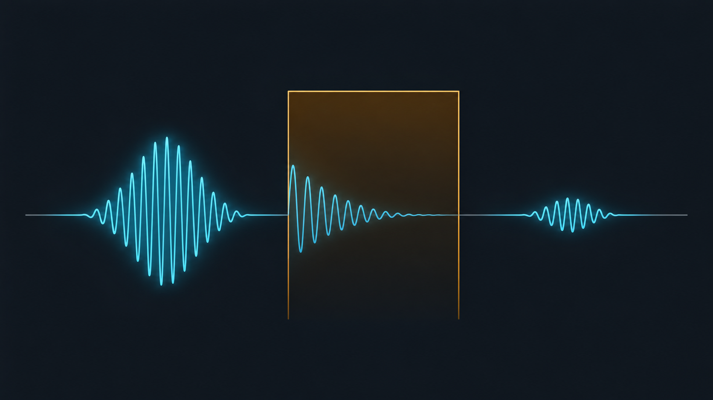 |
| Double-barrier resonance                               | 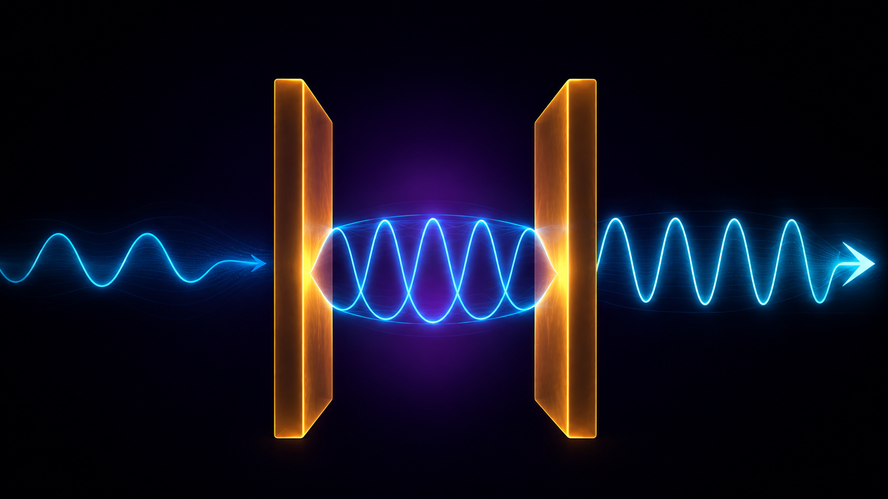     |
| Larmor-clock / attoclock visual                        | 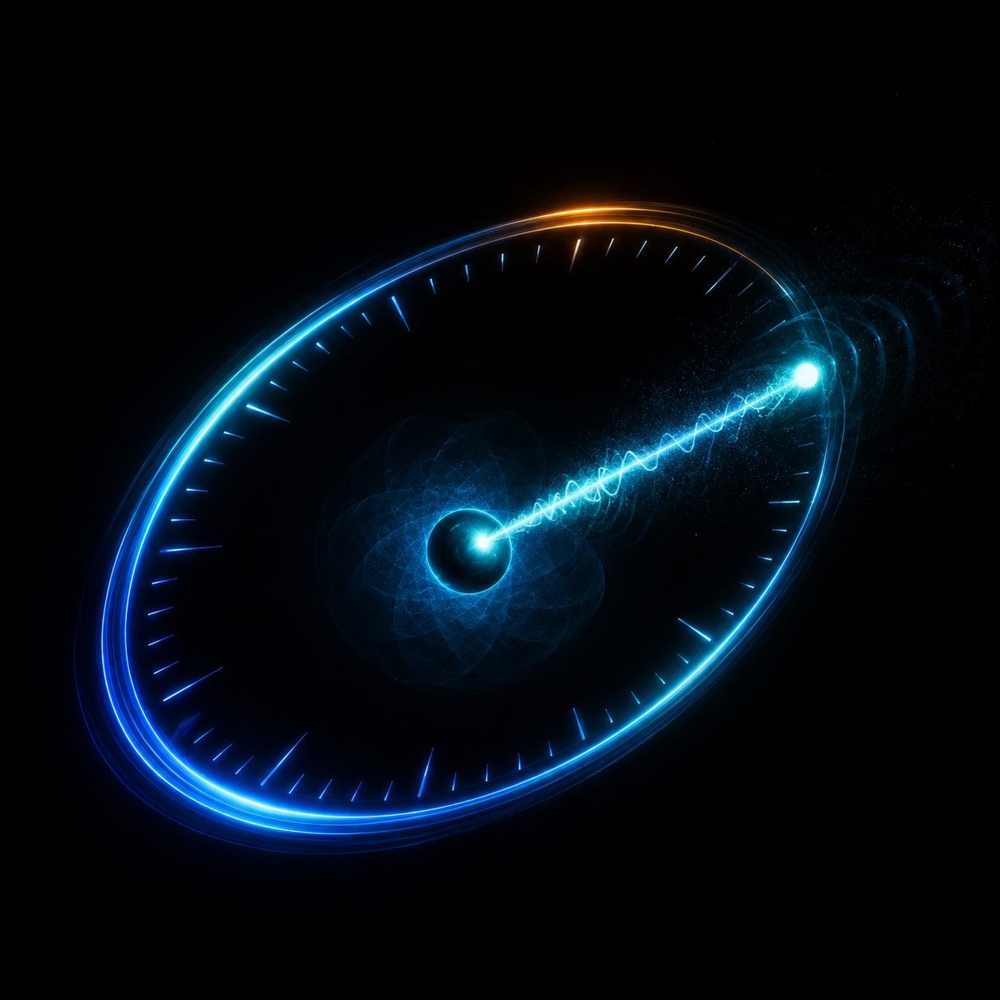                         |
| Hawking-pair horizon tunneling                         | 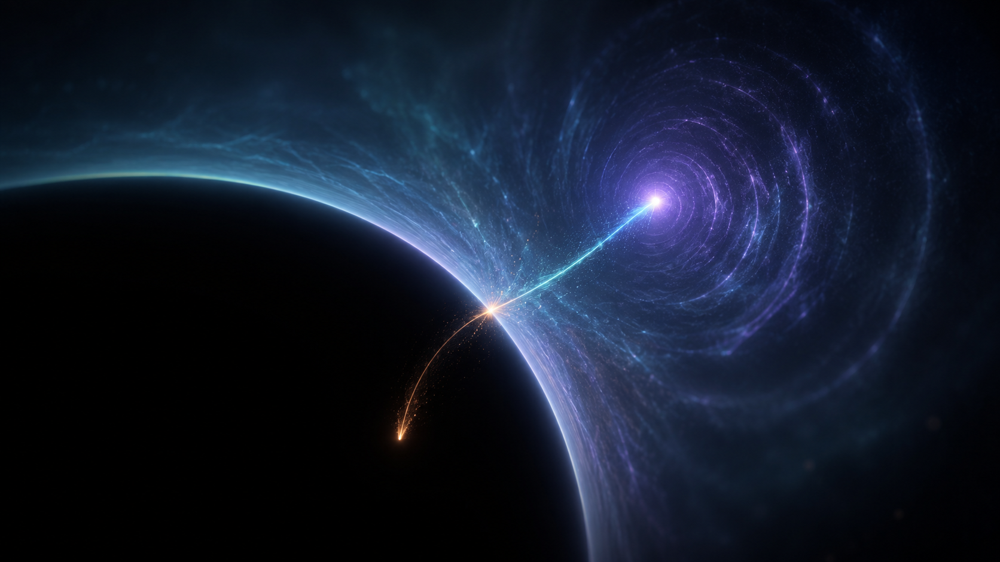                      |
| Bubble nucleation triptych                             | 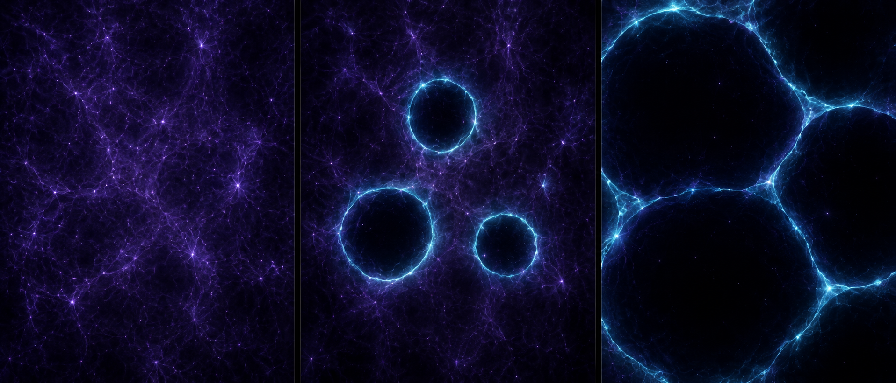                     |
| Washboard potential / macroscopic tunneling            | 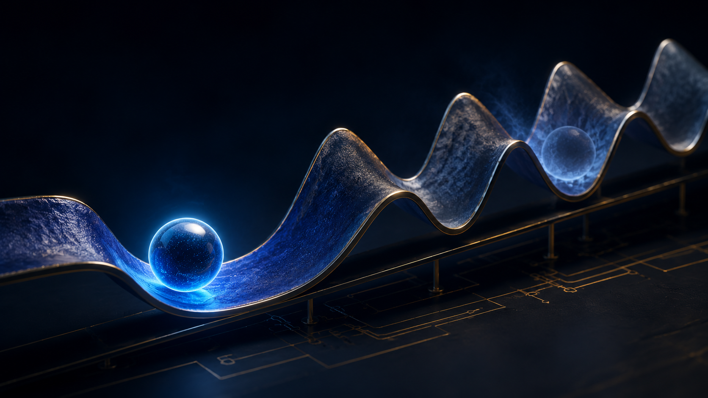         |
| Social thumbnail: thin-slot tunneling                  | 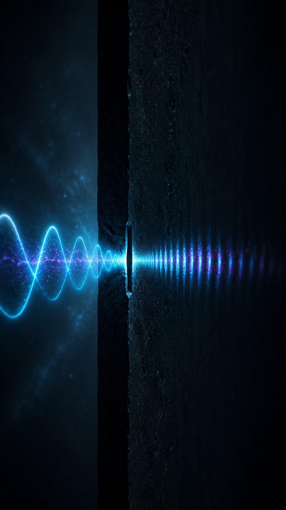                    |
| Social thumbnail: coin through glass wall              | 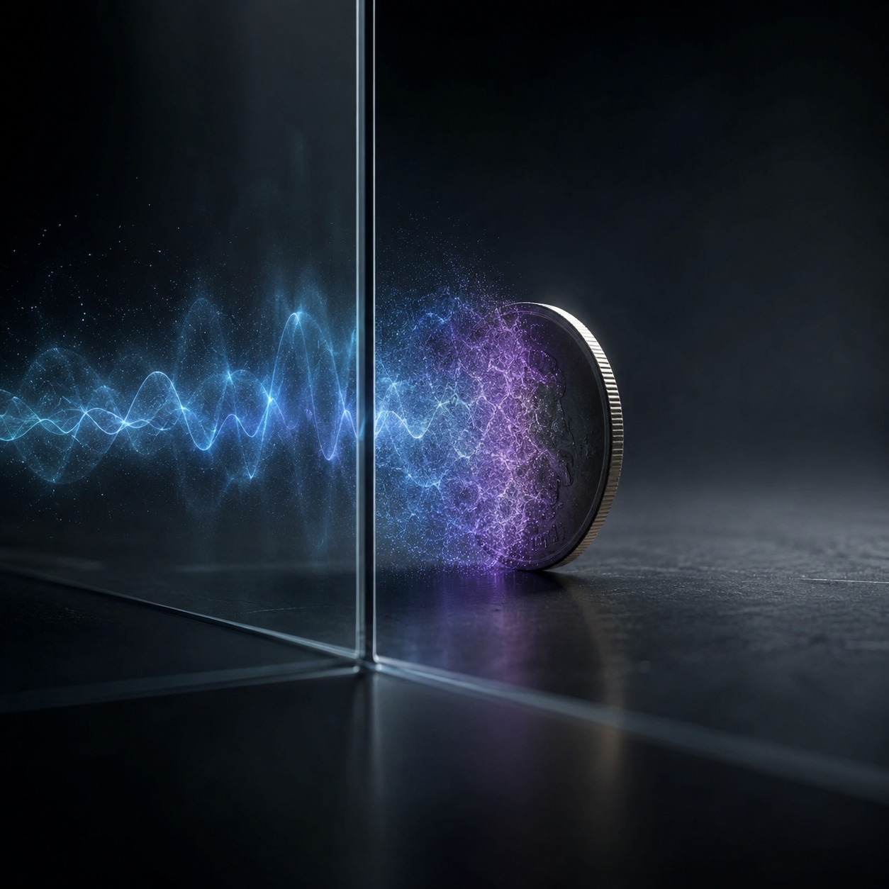             |

---

## Repository structure

```text
quantum-tunneling-spacetime/
├── index.html              ← Interactive simulation webpage
├── README.md
├── LICENSE                 ← MIT
├── .gitignore
├── assets/                 ← Generated hero images, diagrams, and social thumbnails
│   ├── hero-wall-that-isnt-a-wall.png
│   ├── spacetime-mesh-tunneling.png
│   ├── false-vacuum-dawn.png
│   ├── transmission-intuition.png
│   ├── double-barrier-resonance.png
│   ├── larmor-attoclock.png
│   ├── hawking-horizon-tunneling.png
│   ├── bubble-nucleation-triptych.png
│   ├── washboard-potential-mqt.png
│   ├── social-thin-slot-tunneling.png
│   └── social-coin-glass-wall.png
├── docs/                   ← Deep-research notes
│   ├── 01-foundations.md            Non-relativistic tunneling: WKB, transfer matrices, resonances
│   ├── 02-tunneling-time.md         Hartman effect, attoclock, Larmor clock
│   ├── 03-relativistic-tunneling.md Klein paradox, graphene, Dirac equation in curved spacetime
│   ├── 04-cosmological-tunneling.md False vacuum decay, instantons, Hawking radiation as tunneling
│   └── references.md                Full bibliography
├── simulations/            ← Python research code
│   ├── requirements.txt
│   ├── split_operator.py            1D TDSE split-operator FFT propagator
│   ├── transfer_matrix.py           Exact T(E) for piecewise-constant potentials
│   ├── validate.py                  Cross-validation: dynamic vs analytic transmission
│   └── figures/                     Generated plots
└── image-prompts/
    └── PROMPTS.md           ← Curated AI image-generation prompts
```

---

## Quick start

### Webpage

Open `index.html` in any modern browser. Everything — solver, plots, and animations —
is vanilla JavaScript + Canvas in a single file.

For GitHub Pages:

1. Push the repository to GitHub.
2. Go to **Settings → Pages**.
3. Set source to the root of the `main` branch.
4. The page will be served at:

```text
https://biswajit1999.github.io/Quantum-tunneling-spacetime/
```

---

## Python validation suite

```bash
cd simulations
pip install -r requirements.txt
python validate.py
python split_operator.py
python transfer_matrix.py
```

The Python scripts reproduce the browser-side numerics and generate validation
figures for comparison against transfer-matrix results.

---

## Interactive modules

### 1. Wave-packet lab

A Gaussian packet hits a potential barrier, integrated with the split-operator
Strang method on a 1024-point grid with absorbing boundaries. The module shows live
transmission and reflection probabilities.

Presets include:

* square barrier
* double barrier / resonant tunneling
* potential step
* free propagation

---

### 2. Transmission explorer

Exact analytic transmission probability `T(E)` for a square barrier, shown on
linear and logarithmic scales. This module visualises exponential suppression below
the barrier and oscillatory structure above it.

---

### 3. Tunneling-Time Observatory

The distinguishing module of the project: a live Larmor-clock experiment.

A spin-½ spinor wave packet tunnels while a weak magnetic field confined to the
barrier makes its spin precess. The two spinor components see Zeeman-split barriers

```text
V₀ ∓ ω/2
```

and are propagated as parallel split-operator runs. The transmitted spin orientation
is read out at peak flux and converted into the Larmor times:

```text
τ_y = −ħ ∂(arg t) / ∂V₀
τ_z = −ħ ∂(ln|t|) / ∂V₀
```

The measured values are displayed against analytic weak-value results, the Wigner
phase time, and the Büttiker–Landauer time, with a live Hartman-saturation plot.

Headless validation shows measured-vs-analytic agreement at the few-percent level;
finite magnetic-field strength and finite packet width account for the residual.
In the opaque limit, the back-action time follows the expected behaviour.

---

### 4. False vacuum decay

A 2D visual model of bubble nucleation in a metastable vacuum with adjustable
nucleation rate, illustrating Coleman-style decay of spacetime's vacuum state.

---

## Physics summary

* **Units:** `ħ = m = 1` throughout, in both JavaScript and Python. A packet with
  central wavenumber `k₀` has approximately `E ≈ k₀²/2`.

* **Method:** Strang-split spectral propagation,

```text
ψ → exp(−iV dt/2) F⁻¹ exp(−ik²dt/2) F exp(−iV dt/2) ψ
```

The method is unitary and third-order accurate locally in `dt`.

* **Boundaries:** absorbing masks near the grid edges suppress periodic wrap-around.
  Absorbed flux is tallied per side so that `T + R` remains physically interpretable.

* **Validation:** `validate.py` compares wave-packet transmission against the exact
  transfer-matrix result. The transfer matrix matches the analytic formula to
  machine precision, while dynamic-vs-spectral transmission agrees to roughly
  percent-level accuracy for well-resolved cases.

Deep-tunneling cases show larger relative deviations because

```text
T ∝ exp(−2κa)
```

is exponentially sensitive to how a sharp barrier edge is sampled on a finite grid.
Increasing `n` or the simulation length improves convergence.

---

## Research scope

The `docs/` folder goes beyond the simulator and covers:

* non-relativistic tunneling, WKB theory, transfer matrices, and resonances
* the tunneling-time debate from MacColl and Hartman to attoclock and Larmor-clock ideas
* Klein tunneling, graphene analogues, and relativistic tunneling
* false vacuum decay, instantons, and spacetime tunneling
* Hawking radiation interpreted as tunneling through the horizon

All technical claims and historical references should be cited in `docs/references.md`.

---

## License

MIT — see `LICENSE`.
